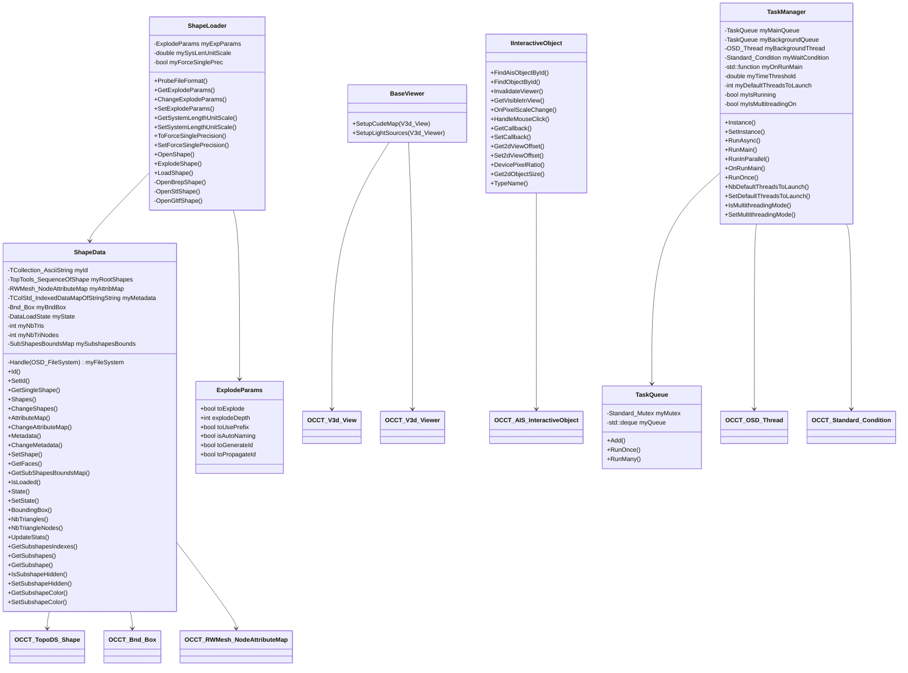

```mermaid
classDiagram
    class BaseViewer {
        +SetupCudeMap(V3d_View)
        +SetupLightSources(V3d_Viewer)
    }
    
    class IInteractiveObject {
        +FindAisObjectById()
        +FindObjectById()
        +InvalidateViewer()
        +GetVisibleInView()
        +OnPixelScaleChange()
        +HandleMouseClick()
        +GetCallback()
        +SetCallback()
        +Get2dViewOffset()
        +Set2dViewOffset()
        +DevicePixelRatio()
        +Get2dObjectSize()
        +TypeName()
    }
    
    class ShapeData {
        -TCollection_AsciiString myId
        -TopTools_SequenceOfShape myRootShapes
        -RWMesh_NodeAttributeMap myAttribMap
        -TColStd_IndexedDataMapOfStringString myMetadata
        -Handle(OSD_FileSystem) myFileSystem
        -Bnd_Box myBndBox
        -DataLoadState myState
        -int myNbTris
        -int myNbTriNodes
        -SubShapesBoundsMap mySubshapesBounds
        +Id()
        +SetId()
        +GetSingleShape()
        +Shapes()
        +ChangeShapes()
        +AttributeMap()
        +ChangeAttributeMap()
        +Metadata()
        +ChangeMetadata()
        +SetShape()
        +GetFaces()
        +GetSubShapesBoundsMap()
        +IsLoaded()
        +State()
        +SetState()
        +BoundingBox()
        +NbTriangles()
        +NbTriangleNodes()
        +UpdateStats()
        +GetSubshapesIndexes()
        +GetSubshapes()
        +GetSubshape()
        +IsSubshapeHidden()
        +SetSubshapeHidden()
        +GetSubshapeColor()
        +SetSubshapeColor()
    }
    
    class ShapeLoader {
        -ExplodeParams myExpParams
        -double mySysLenUnitScale
        -bool myForceSinglePrec
        +ProbeFileFormat()
        +GetExplodeParams()
        +ChangeExplodeParams()
        +SetExplodeParams()
        +GetSystemLengthUnitScale()
        +SetSystemLengthUnitScale()
        +ToForceSinglePrecision()
        +SetForceSinglePrecision()
        +OpenShape()
        +ExplodeShape()
        +LoadShape()
        -OpenBrepShape()
        -OpenStlShape()
        -OpenGltfShape()
    }
    
    class TaskManager {
        -TaskQueue myMainQueue
        -TaskQueue myBackgroundQueue
        -OSD_Thread myBackgroundThread
        -Standard_Condition myWaitCondition
        -std::function myOnRunMain
        -double myTimeThreshold
        -int myDefaultThreadsToLaunch
        -bool myIsRunning
        -bool myIsMultitreadingOn
        +Instance()
        +SetInstance()
        +RunAsync()
        +RunMain()
        +RunInParallel()
        +OnRunMain()
        +RunOnce()
        +NbDefaultThreadsToLaunch()
        +SetDefaultThreadsToLaunch()
        +IsMultithreadingMode()
        +SetMultithreadingMode()
    }
    
    class ExplodeParams {
        +bool toExplode
        +int explodeDepth
        +bool toUsePrefix
        +bool isAutoNaming
        +bool toGenerateId
        +bool toPropagateId
    }
    
    class TaskQueue {
        -Standard_Mutex myMutex
        -std::deque myQueue
        +Add()
        +RunOnce()
        +RunMany()
    }
    
    BaseViewer --> OCCT_V3d_View
    BaseViewer --> OCCT_V3d_Viewer
    IInteractiveObject --> OCCT_AIS_InteractiveObject
    ShapeData --> OCCT_TopoDS_Shape
    ShapeData --> OCCT_Bnd_Box
    ShapeData --> OCCT_RWMesh_NodeAttributeMap
    ShapeLoader --> ShapeData
    ShapeLoader --> ExplodeParams
    TaskManager --> TaskQueue
    TaskManager --> OCCT_OSD_Thread
    TaskManager --> OCCT_Standard_Condition
```