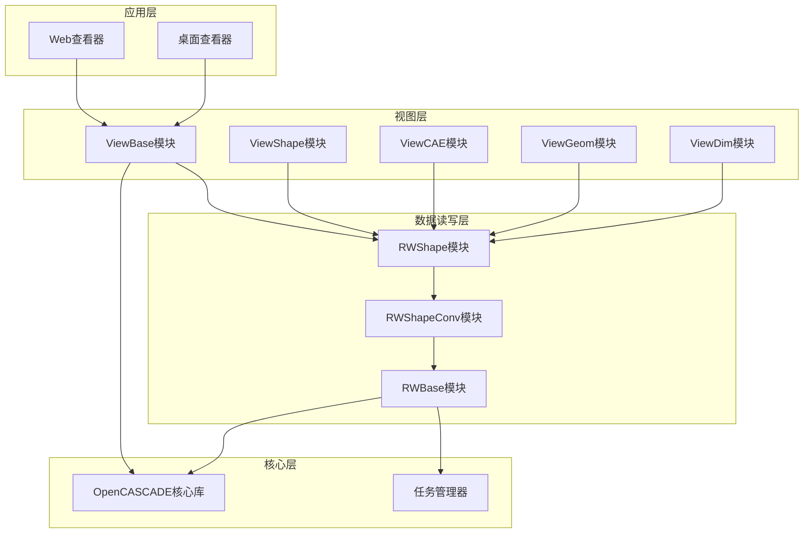

```mermaid
graph TB
    subgraph "应用层"
        WebViewer[Web查看器]
        DesktopViewer[桌面查看器]
    end
    
    subgraph "视图层"
        ViewBase[ViewBase模块]
        ViewShape[ViewShape模块]
        ViewCAE[ViewCAE模块]
        ViewGeom[ViewGeom模块]
        ViewDim[ViewDim模块]
    end
    
    subgraph "数据读写层"
        RWShape[RWShape模块]
        RWShapeConv[RWShapeConv模块]
        RWBase[RWBase模块]
    end
    
    subgraph "核心层"
        OCCT[OpenCASCADE核心库]
        TaskManager[任务管理器]
    end
    
    WebViewer --> ViewBase
    DesktopViewer --> ViewBase
    ViewBase --> RWShape
    ViewShape --> RWShape
    ViewCAE --> RWShape
    ViewGeom --> RWShape
    ViewDim --> RWShape
    RWShape --> RWShapeConv
    RWShapeConv --> RWBase
    RWBase --> TaskManager
    RWBase --> OCCT
    ViewBase --> OCCT
```